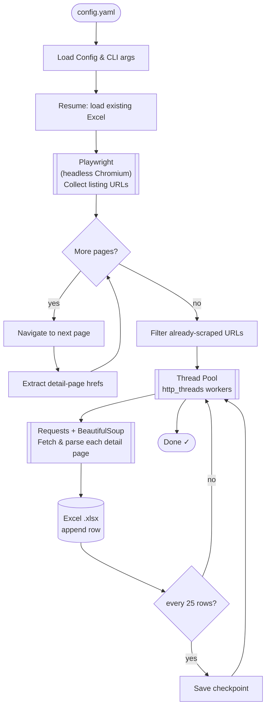
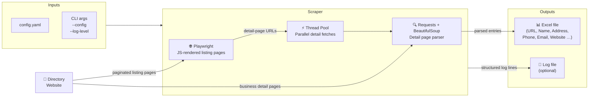

# Business Directory Scraper

A generic and configurable Python scraper for business directory websites.

This project extracts business listings from directory-style websites that provide
paginated overview pages and individual detail pages.  
It is intentionally kept generic so it can be adapted to different directory platforms.

---

## How It Works

### Scraping Pipeline



### Architecture Overview



---

## Features

- **External configuration** — all settings in a single `config.yaml` file
- **Structured logging** — timestamped live shell output with configurable log levels; optional log file
- **Playwright-based scraping** — handles JavaScript-rendered listing pages
- **Requests + BeautifulSoup** — fast, lightweight parsing for detail pages
- **Resume support** — already scraped URLs are automatically skipped
- **Rate limiting and retry handling** — respects `Retry-After` headers; exponential back-off
- **Excel export** — `openpyxl`-powered, progress-saved every 25 rows

---

## Requirements

- Python 3.9+
- Google Chromium (installed via Playwright)

---

## Setup

```bash
# 1. Install Python dependencies
pip install -r requirements.txt

# 2. Install the Chromium browser used by Playwright
playwright install chromium
```

---

## Configuration

All website-specific settings live in **`config.yaml`** — no need to edit the Python source.

```yaml
# Target website
base_url: "https://example-directory.tld"
start_url: "https://example-directory.tld/listings/region"

# Output file
output_xlsx: "business_listings.xlsx"

# Performance
http_threads: 1
request_timeout: 25
max_retries: 6
max_listing_pages: 500

# Politeness delay (seconds, randomised)
sleep_detail_min: 0.15
sleep_detail_max: 0.45

# URL pattern — adjust to match the target site's detail-page URL scheme
detail_page_pattern: "^/[a-z0-9-]+_[A-Za-z0-9]+$"

# Logging
log_level: "INFO"   # DEBUG | INFO | WARNING | ERROR
log_file: ""        # leave empty to log to console only
```

### Configuration reference

| Key                   | Description                                               | Default                         |
| --------------------- | --------------------------------------------------------- | ------------------------------- |
| `base_url`            | Base domain of the directory website                      | `https://example-directory.tld` |
| `start_url`           | First listing page (page 1)                               | —                               |
| `output_xlsx`         | Output Excel file name                                    | `business_listings.xlsx`        |
| `http_threads`        | Parallel detail-page requests (keep low to be polite)     | `1`                             |
| `request_timeout`     | HTTP request timeout in seconds                           | `25`                            |
| `max_retries`         | Retry attempts per failed request                         | `6`                             |
| `max_listing_pages`   | Safety cap for paginated listing pages                    | `500`                           |
| `sleep_detail_min`    | Minimum random delay between requests (seconds)           | `0.15`                          |
| `sleep_detail_max`    | Maximum random delay between requests (seconds)           | `0.45`                          |
| `detail_page_pattern` | Regex that identifies detail-page hrefs on listing pages  | `^/[a-z0-9-]+_[A-Za-z0-9]+$`   |
| `log_level`           | Console/file log verbosity                                | `INFO`                          |
| `log_file`            | If set, log messages are also written to this file        | *(empty)*                       |

---

## Usage

```bash
# Run with the default config.yaml in the current directory
python Business-Directory-Scraper.py

# Use a custom config file
python Business-Directory-Scraper.py --config my_config.yaml

# Override the log level at runtime
python Business-Directory-Scraper.py --config config.yaml --log-level DEBUG
```

### CLI arguments

| Argument      | Description                                      | Default         |
| ------------- | ------------------------------------------------ | --------------- |
| `--config`    | Path to the YAML configuration file              | `config.yaml`   |
| `--log-level` | Override log level (`DEBUG`/`INFO`/`WARNING`/`ERROR`) | *(from config)* |

---

## Live shell output

The scraper prints structured, timestamped log lines while running:

```
[INFO    ] 10:42:01  Config loaded from: config.yaml
[INFO    ] 10:42:01  Output file: business_listings.xlsx
[INFO    ] 10:42:01  Resume: 0 entries already saved
[INFO    ] 10:42:02  [LIST] Page 1 — loading https://example-directory.tld/listings/region
[INFO    ] 10:42:04  [LIST] Page 1: +48 new links (total: 48)
[INFO    ] 10:42:05  [LIST] Page 2 — loading https://example-directory.tld/listings/region/2
...
[INFO    ] 10:45:11  [12/48] Saved: Acme Plumbing GmbH
[INFO    ] 10:45:14  [13/48] Saved: Best Electric AG
...
[INFO    ] 10:48:22  Done — 48 listings written to business_listings.xlsx
```

---

## Output

The generated Excel file contains the following columns:

| Column           | Description                                 |
| ---------------- | ------------------------------------------- |
| URL              | Detail page URL                             |
| Name             | Business name (from `<h1>`)                 |
| Address          | Heuristically detected street + city line   |
| Phone            | Phone number (from `<a href="tel:…">`)      |
| Email            | Email address (from `<a href="mailto:…">`)  |
| Website          | First external link on the detail page      |
| UID              | *(optional — extend parser)*                |
| Registry Number  | *(optional — extend parser)*                |
| Credit Reference | *(optional — extend parser)*                |

Additional fields can be added by extending the `ListingEntry` dataclass and the
`parse_listing_html()` function.

---

## Adapting the Scraper

1. **Edit `config.yaml`** — set `base_url`, `start_url`, and `detail_page_pattern` for the target site.
2. **Adjust `parse_listing_html()`** — the heuristic extraction rules are intentionally simple and
   site-specific; modify selectors and field logic as needed.
3. **Tune performance** — increase `http_threads` for faster scraping, or raise `sleep_detail_min`/`sleep_detail_max`
   to be more polite.

---

## Disclaimer

This project is intended for educational and research purposes only.

Before scraping any website, make sure to:

- Review the website's Terms of Service
- Respect `robots.txt`
- Use reasonable request limits

The author assumes no responsibility for misuse of this software.
